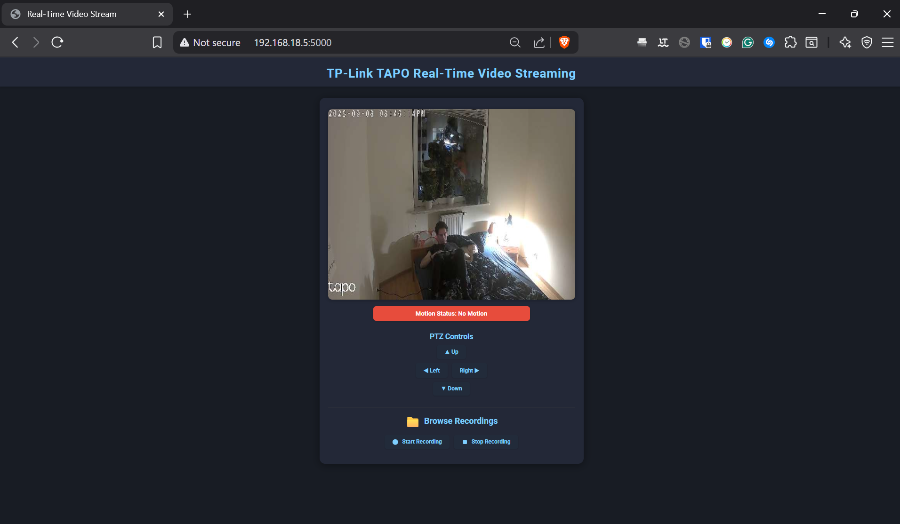

# Tapo Camera Integration

## Overview

This Python application integrates with TP-Link Tapo cameras, allowing users to access camera feeds, control camera settings, and manage recordings. It provides a convenient web interface for monitoring and managing Tapo cameras on your network.



## Features

- Live camera feed streaming
- Camera pan and tilt control
- Motion detection settings
- Recording management
- Camera settings configuration

## Prerequisites

- TP-Link Tapo Camera, 
- connected to your local network, and its IP address `<ip_of_camera>`,
- provisioned with TAPO Application,
- TAPO Camera login credentials  ` <camera_username>` & ` <camera_passwd> `, 
- Thirdparty Features enabled in application

## How to Connect and Provision Your Tapo Camera

1. **Download the Tapo App**
    - Install the Tapo app from [Google Play Store](https://play.google.com/store/apps/details?id=com.tplink.tapo) or [Apple App Store](https://apps.apple.com/us/app/tapo/id1472718009)
    - Create or log in to your TP-Link account

2. **Prepare Your Camera**
    - Plug your Tapo camera into a power outlet
    - Wait for the LED indicator to blink red and green alternately

3. **Connect Camera to WiFi**
    - Open the Tapo app on your mobile device
    - Tap the "+" button in the top right corner
    - Select your camera model from the device list
    - Follow the in-app instructions to:
      - Connect your phone to the camera's temporary WiFi network
      - Select your home WiFi network
      - Enter your WiFi password

4. **Complete Setup**
    - Name your camera
    - Create a device password (this will be your `<camera_username>` and `<camera_passwd>`)
    - Wait for the camera to connect to your network

5. **Enable Third-Party Access**
    - In the Tapo app, select your camera
    - Go to Settings (gear icon)
    - Navigate to "Advanced Settings"
    - Enable "Third-Party Service Integration"
    - Save your settings

6. **Find Camera IP Address**
    - In the Tapo app, go to your camera settings
    - Look for "Device Information" or similar option
    - Note the IP address shown (this will be your `<ip_of_camera>`)

7. **Test Connection**
    - Ensure your computer is on the same network as the camera
    - Proceed to the Configuration section to set up the application

## Configuration

### Important, before using the software. TAPO Cameras let you use their API features after authentication, you can do it in two ways:

* One way is to log using: <br>
 
    ` username: admin `  <br>
    ` password: <your_tp-link-cloud-password> `  <br>

* The other one is to log in to your cammera locally using the camera credentials (created in Provisioning): <br>

    ` username: <camera-username> `  <br>
    ` password: <camera-passwd> `  <br>

### Create the `config.json` file to set up your camera details:

```json
{
    "user": "admin",  
    "password": "<tp-link-cloud-password>",
    "host": "<ip_of_camera>",
    "rtsp_url": "rtsp://<camera-username>:<camera-passwd>@<camera-ip>/stream1"
}
```

## Installation

1. Clone the repository:
    ```
    git clone https://github.com/MarcinMazur242467/Tapo-Camera
    cd tapo-camera
    ```

2. Install dependencies using uv (install uv beforehand from this [link](https://docs.astral.sh/uv/getting-started/installation/)):
    ```
    uv sync --locked
    ```

3. Running with Python 

    Start the application:
    ```
    uv run run.py
    ```

    Access the web interface at:
    ```
    http://localhost:5000
    ```

4. Running with Docker

    Build the Docker image:
    
    ```
    docker build -t tapo-camera .
    ```

    Run the container:
    ```
    docker run -p 5000:5000 --name tapo-camera-app tapo-camera
    ```

    Access the web interface at:
    ```
    http://localhost:5000
    ```

## Technologies

- **Python 3.13**: Porogramming language
- **Flask**: Web framework for Python
- **Flask-SocketIO**: WebSocket communication for real-time video
- **OpenCV**: Video capture and processing
- **pytapo**: Library to control Tapo cameras
- **Eventlet**: Concurrent networking for WebSockets
- **Docker**: Containerization for easy deployment

## Troubleshooting

- **Authentication Issues**: For some firmware versions, API authentication may not work with local camera credentials. In that case, use 'admin' and your TP-Link cloud password.
- **Device temporary unavaliable**: If you tried to log in with incorect credentials, camera will block you for 30 minutes. 
- **Third-Party Access**: Ensure Third Party Compatibilities are enabled in the Tapo app under Advanced Settings.
- **Network Connectivity**: Verify your camera and computer are connected to the same local network.
- **IP Address**: Confirm the camera's IP address in your config.json is correct and current.
- **Port Forwarding**: If accessing remotely, check that proper port forwarding is configured on your router.
- **Firewall Settings**: Ensure your firewall allows communication on the required ports.
- **Camera Reboot**: If the camera becomes unresponsive, try power cycling it (unplug for 10 seconds, then reconnect).
- **RTSP Stream Test**: If you have problem with using application test RTSP connection wit tools like [VLC](https://www.videolan.org/vlc/)
- **Log Files**: Check application logs for specific error messages that might indicate the source of problems.

## License

This project is licensed under the MIT License.